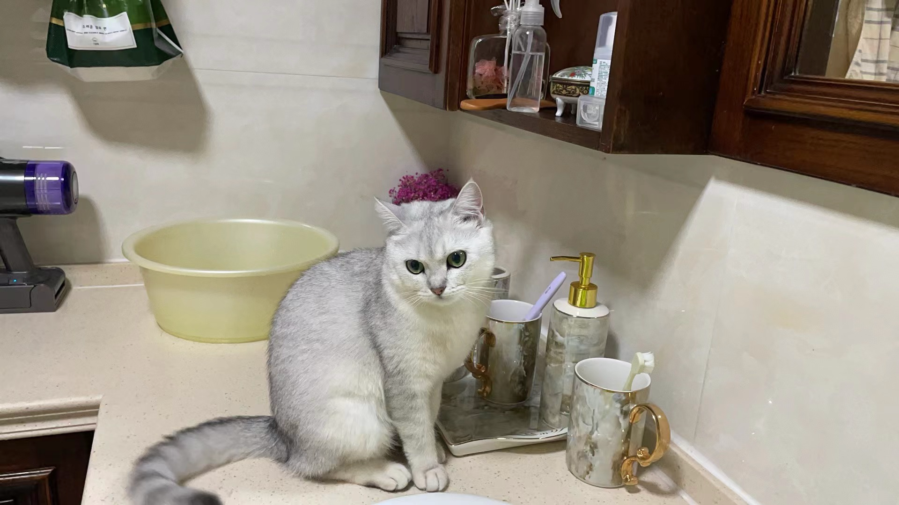
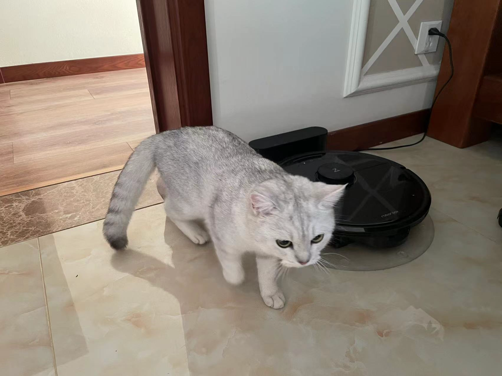



Education
======
* M.S. in Statistics and Data Science, University of North Carolina at Chapel Hill, 2027 (expected)
* B.Eng. in Artificial Intelligence, Nanjing University, 2025

Work experience
======
<!-- * Spring 2024: Academic Pages Collaborator
  * GitHub University
  * Duties includes: Updates and improvements to template
  * Supervisor: The Users

* Fall 2015: Research Assistant
  * GitHub University
  * Duties included: Merging pull requests
  * Supervisor: Professor Hub

* Summer 2015: Research Assistant
  * GitHub University
  * Duties included: Tagging issues
  * Supervisor: Professor Git -->

* Fall 2025 - Present: Part-time Cook
  * Kitchen Institute of Technology
  * Duties included: Cooking for myself
  * Supervisor: Jiaheng Guo

* All Summers and Winters from 2023 to 2025: Pet Sitter Intern
  * Guo University
  * Duties included: Taking care of my parents' cat, Lil Mi
  * Supervisor: My Parents

Skills
======
* Python
  * PyTorch
  * TensorFlow

* C++
  * CUDA

* Cooking
  * Baked potato, Beef with tomato, Scrambled eggs, Boiled water, etc.
  * The Ultimate Secret: You should add more seasonings

* Pet Sitting
  * I fed Lil Mi with a lot of food and it gained a lot of weight (previous {: width="200px"} {: width="200px"} to current {: width="200px"} {: width="200px"} {: width="200px"})
  * Cats love ice cream`

<!-- Publications
======
  <ul>
    
  </ul>
  
Talks
======
  <ul>
    
  </ul>
  
Teaching
======
  <ul>
    
  </ul>
  
Service and leadership
====== -->

