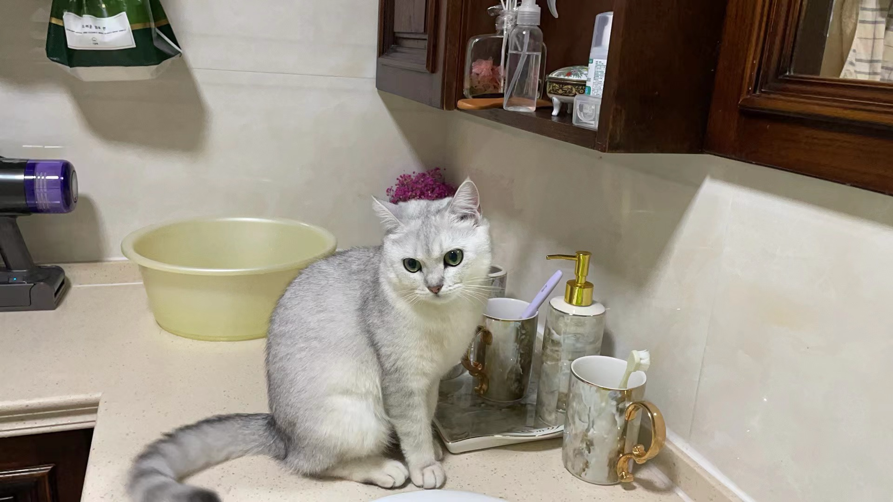
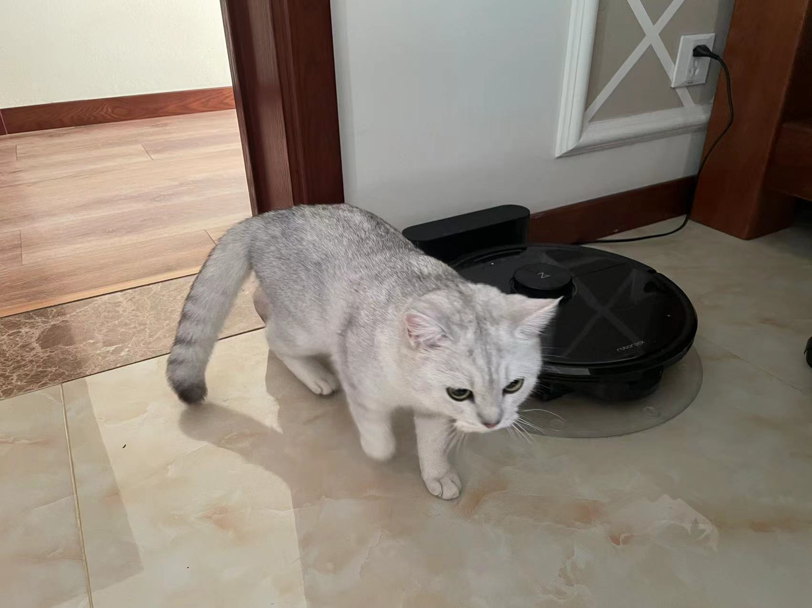



More About Me
======
My Chinese name is 郭家亨, pronounced as "Gwoh-Jah-Hen". You can call me Henry for convenience.

Experiences (Non-academic)
======
* Fall 2025 - Present: Part-time Cook
  * Kitchen Institute of Technology
  * Duties included: Cooking for myself
  * Supervisor: Jiaheng Guo

* All Summers and Winters from 2023 to 2025: Pet Sitter Intern
  * Guo University
  * Duties included: Taking care of my parents' cat, Lil Mi
  * Supervisor: My Parents

Skills (Non-academic) and Hobbies
======
* Cooking
  * Baked potato, Beef with tomato, Scrambled eggs, Baorou Guo (failed), Soy-sauce-fried rice with egg n corn n tomato n beans n pepper n sausage n ground beef, etc.
  * The Ultimate Secret: You should add more seasonings

* Pet Sitting
  * Cats love ice cream
  * I fed Lil Mi a lot of food and she gained a lot of weight
  

  <figure style="text-align:center;">
    
    <figcaption>Before 1</figcaption>
  </figure>
  <figure style="text-align:center;">
    
    <figcaption>Before 2</figcaption>
  </figure>
  <figure style="text-align:center;">
    
    <figcaption>After 1</figcaption>
  </figure>
  <figure style="text-align:center;">
    
    <figcaption>After 2</figcaption>
  </figure>
  <figure style="text-align:center;">
    
    <figcaption>After 3</figcaption>
  </figure>
  

* Games
  * League of Legends (ARAM main, Best Solo/Duo Rank: Gold 4, Used to be a Yasuo King but now I am old)
  * Teamfight Tactics (Grandmaster for multiple seasons)
  * Clash of Clans (Achieved Rank #11,693 on the Chinese server)
  * Valorant (0/13 KAY/O)
  * PUBG: Battlegrounds (2x Winner Winner Chicken Dinner with 0 kills)

* Photography
  * I take photos during trips and daily life: [photography page](/photography/)

* Music
  * I play the clarinet (level 10)
  * For pop music, since I am a Riot Games fan, I truly enjoy their music. Some of my favorites are
    * [His Name is Sahn-Uzal](https://www.youtube.com/watch?v=V-iBklZUq-k&t=3) feat. Radik Tyulyush
    * [Fantastic](https://www.youtube.com/watch?v=t9mpyRzipww&list=RDt9mpyRzipww&start_radio=1) feat. King Princess
    * [EGO](https://www.youtube.com/watch?v=jAj_nbWYb7g&list=RDjAj_nbWYb7g&start_radio=1) feat Qing Madi
  * I enjoy legendary Chinese songs such as 定军山(屠洪刚)， 江山(马德钟), etc.