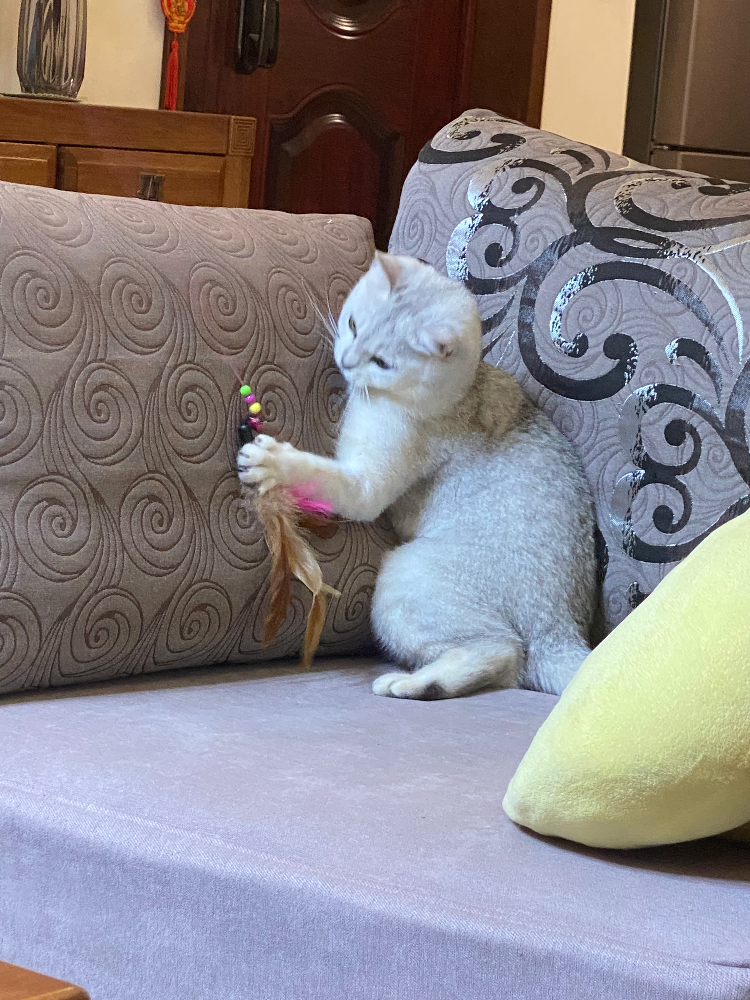
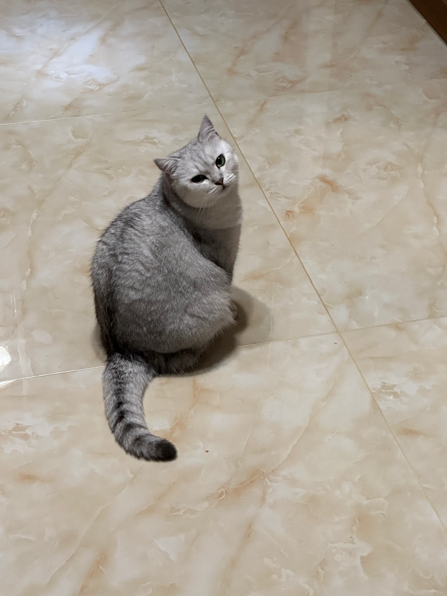
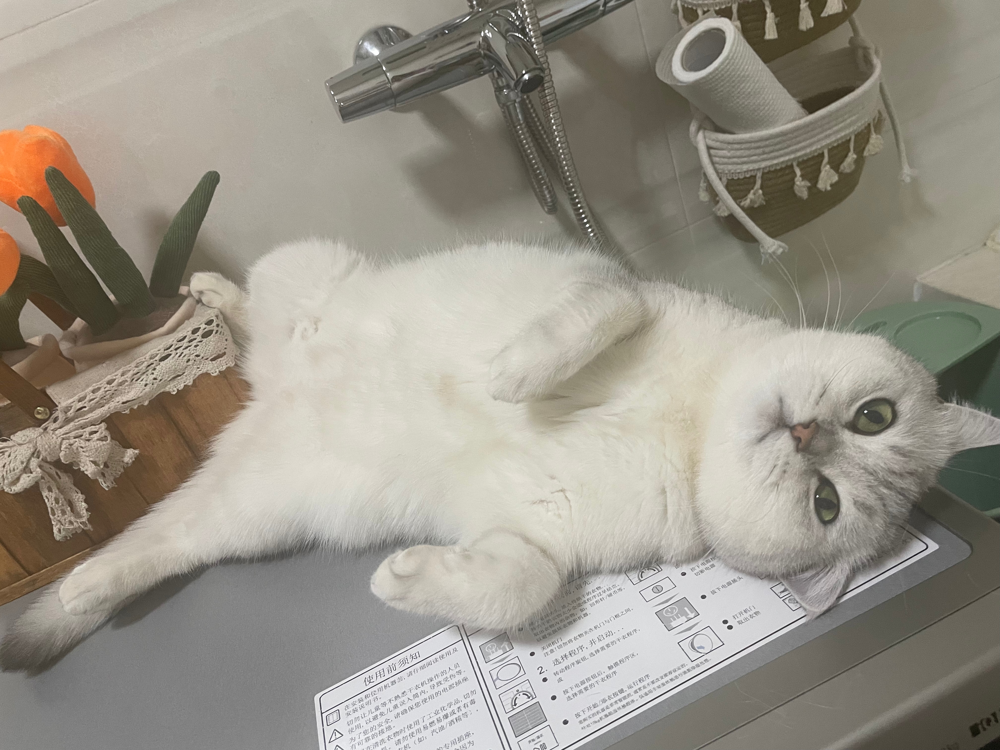
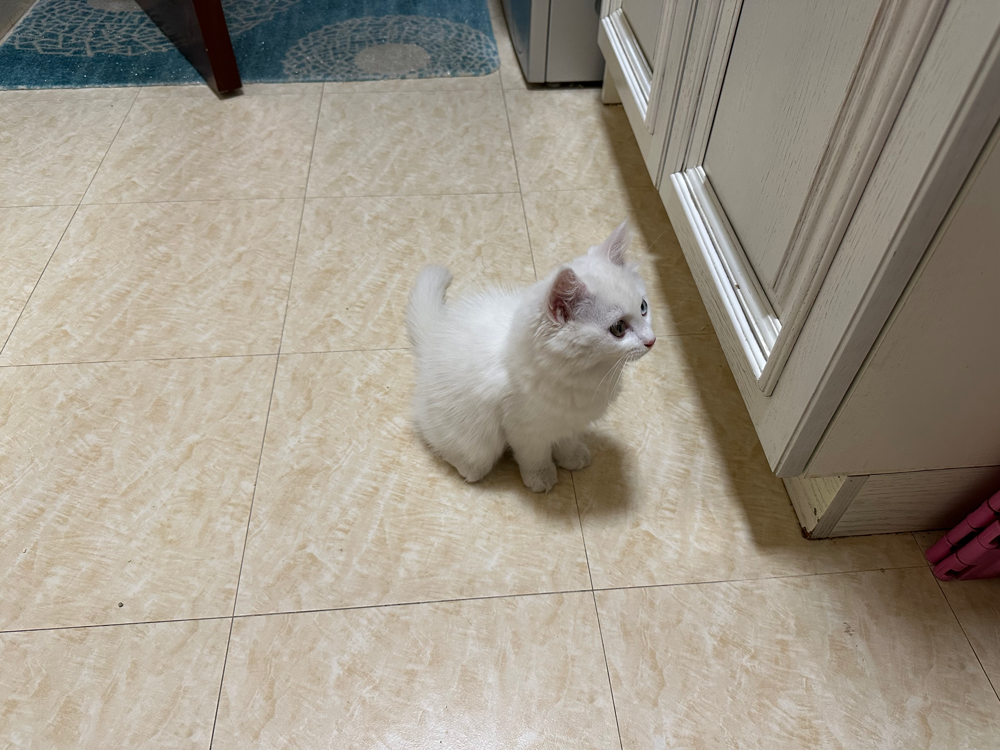



I am not a professional photographer, but I enjoy taking photos during trips and daily life. Here are some of my favorite shots.

## Cats

The silver shaded British Shorthair cat, Lil Mi,  is my parents' pet. She is cute and chubby. The white cat with blue and yellow eyes was Sixi, my friend's cat. She was clever and energetic.

  

  

  

  

  

  

  

  

  

  

  

<!--  -->

  

  

  

  

<!--  -->
<!--  -->

## Landscapes

### Shenyang (Grand Northeast My Hometown, for real)

### Nanjing

### Xinjiang

### Yunnan
